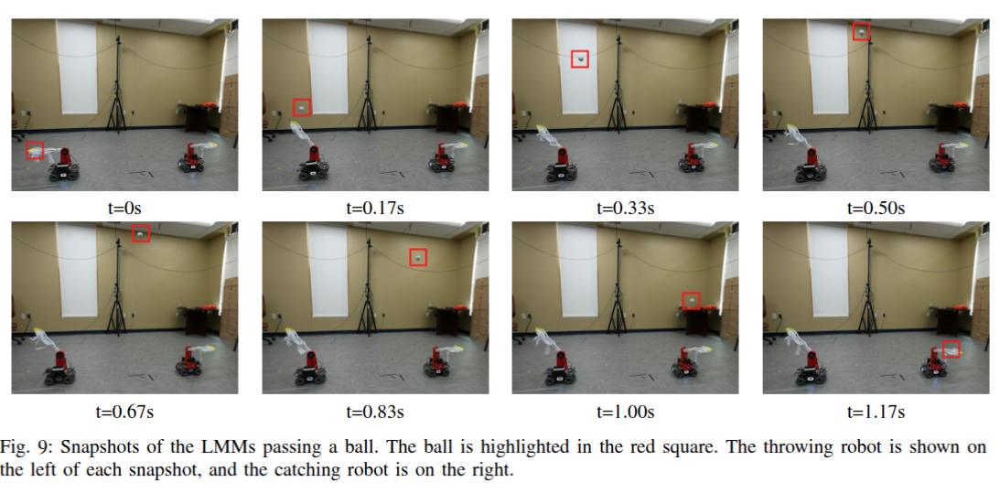

# Mobile Manipulator For Robotic Lacrosse: Learning to Pass the Ball

A ROS-based autonomous robot lacrosse system with intelligent ball catching, throwing, and trajectory prediction capabilities using machine learning models.

## Demo

📹 **Video Demo**: [Robot Lacrosse in Action](https://youtu.be/6cvI5YItgjk)


*The complete robot lacrosse system in operation*

## Overview

This project implements an intelligent lacrosse-playing robot system that can:
- Track and predict ball trajectories using LSTM neural networks
- Autonomously navigate to catch flying balls
- Calculate optimal throwing angles and speeds
- Control robotic arm for precise ball throwing
- Support both centralized and decentralized control architectures

## Features

- **Intelligent Ball Tracking**: Real-time ball trajectory prediction using LSTM models
- **Autonomous Navigation**: Smart chassis control for optimal positioning
- **Precision Throwing**: ML-powered arm control with angle and speed optimization
- **OptiTrack Integration**: High-precision motion capture system integration
- **Simulation Support**: Gazebo simulation environment for testing
- **Manual Control**: Remote control capabilities for debugging and testing
- **Data Collection**: Comprehensive data logging for model training

## System Architecture

### Core Components

- **Robot Class** (`scripts/Robot.py`): Main robot controller with ML models
- **Arm Control** (`scripts/arm_control/`): Robotic arm management and throwing logic
- **Chassis Control** (`scripts/chassis_control/`): Mobile base navigation and positioning
- **Data Processing** (`scripts/data_process/`): ML model training and trajectory analysis
- **OptiTrack SDK** (`scripts/optitrack_sdk/`): Motion capture system interface

### Server Components

- **Robot Server** (`robot_server.py`): Main robot control server
- **Arm Server** (`arm_server.py`): Dedicated arm control server
- **Chassis Server** (`chassis_server.py`): Chassis control server
- **Ball Launcher Server** (`ball_launcher_server.py`): Ball launching system

## Installation

### Prerequisites

- ROS Melodic/Noetic
- Python 3.6+
- CUDA-capable GPU (recommended for ML models)

### Dependencies

Install Python dependencies:

```bash
cd scripts/
pip install -r requirements.txt
```

ROS dependencies are specified in `package.xml`:
- `roscpp`
- `rospy` 
- `std_msgs`

### Additional Requirements

- PyTorch for neural network models
- OpenCV for computer vision
- OptiTrack SDK for motion capture
- RoboMaster SDK for hardware control

## Usage

### Simulation Mode

1. Launch the simulation environment:
```bash
roslaunch robot_lacrosse simulate.launch
```

2. Run test scenarios:
```bash
rosrun robot_lacrosse gazebo_function_test.py
```

### Real Robot Operation

1. Start the robot server:
```bash
python robot_server.py
```

2. For decentralized control:
```bash
python robot_server_decentralized.py
```

3. Run real robot tests:
```bash
python scripts/real_robot_test.py
```

### Manual Control

Start the manual control interface:
```bash
python scripts/manual_control/server.py
python scripts/manual_control/client.py
```

## Machine Learning Models

The system uses several trained ML models:

- **LSTM Trajectory Predictor** (`save_model.pth`): Predicts ball landing points
- **Arm Control MLP** (`save_model_throw.pth`): Optimizes throwing parameters
- **Speed Control Model** (`save_model_throw_speed.pth`): Fine-tunes throwing speed

### Model Training

Train new models using the data processing scripts:

```bash
python scripts/throw_ml.py
python scripts/throw_ml_speed.py
python scripts/lstm_scratch.py
```

## Configuration

### Robot Parameters

Key parameters in `scripts/Robot.py`:
- `max_speed`: Maximum robot velocity (3 m/s)
- `arm_pose`: Arm offset position `[-0.35, 0, 0.3]`
- `g`: Gravity constant (9.8 m/s²)

### Control Parameters

Adjust control gains in the respective controller files:
- P-control gains for positioning
- Trajectory prediction parameters
- Throwing angle/speed limits

## Data Collection

The system includes comprehensive data collection capabilities:

- Ball trajectory data
- Robot pose data  
- Arm state recordings
- Performance metrics

Data is saved in structured formats under `scripts/saved_data/`.

## Testing

### Unit Tests

- `scripts/p_control_test.py`: P-controller validation
- `scripts/parabola_test.py`: Trajectory prediction testing
- `scripts/arm_control/arm_test.py`: Arm functionality tests

### Integration Tests

- `scripts/gazebo_test_global.py`: Global coordination tests
- `scripts/gazebo_test_local.py`: Local behavior tests
- `scripts/real_robot_test.py`: Hardware integration tests

## Project Structure

```
robot_lacrosse/
├── README.md
├── package.xml
├── CMakeLists.txt
├── launch/
│   └── simulate.launch
├── scripts/
│   ├── Robot.py                    # Main robot class
│   ├── arm_control/               # Arm control modules
│   ├── chassis_control/           # Chassis control
│   ├── data_process/              # Data analysis & ML
│   ├── manual_control/            # Remote control
│   ├── optitrack_sdk/             # Motion capture
│   └── saved_data/                # Training data
└── *.py                           # Server implementations
```

## Contributing

1. Follow ROS coding standards
2. Test changes in simulation before hardware
3. Document new features and parameters
4. Include unit tests for new functionality

## License

This project is licensed under the terms specified in the package.xml file.

## Maintainer

- **xinchi** - xinchi@todo.todo

## Acknowledgments

- Built with ROS (Robot Operating System)
- Uses OptiTrack motion capture system
- Integrates RoboMaster hardware platform
- Powered by PyTorch machine learning framework
